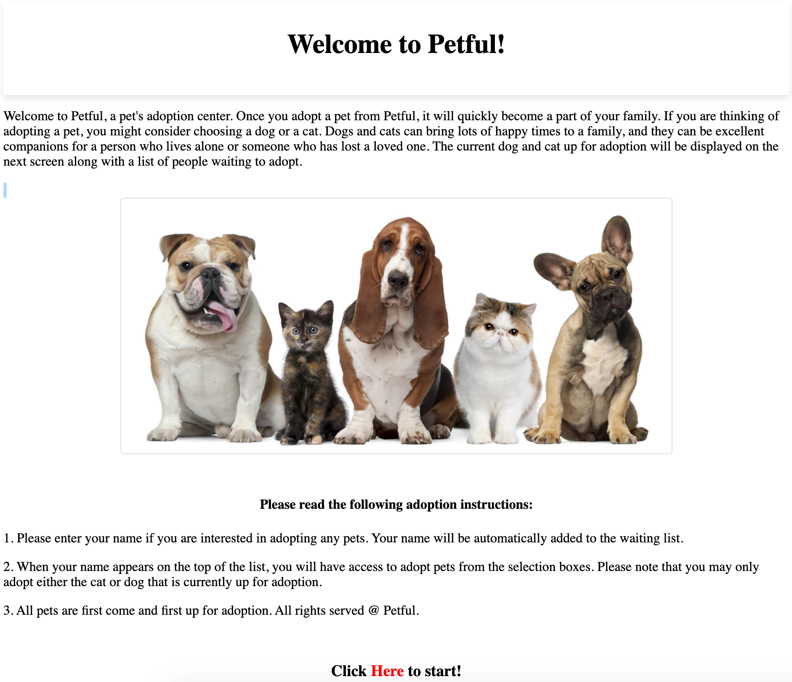
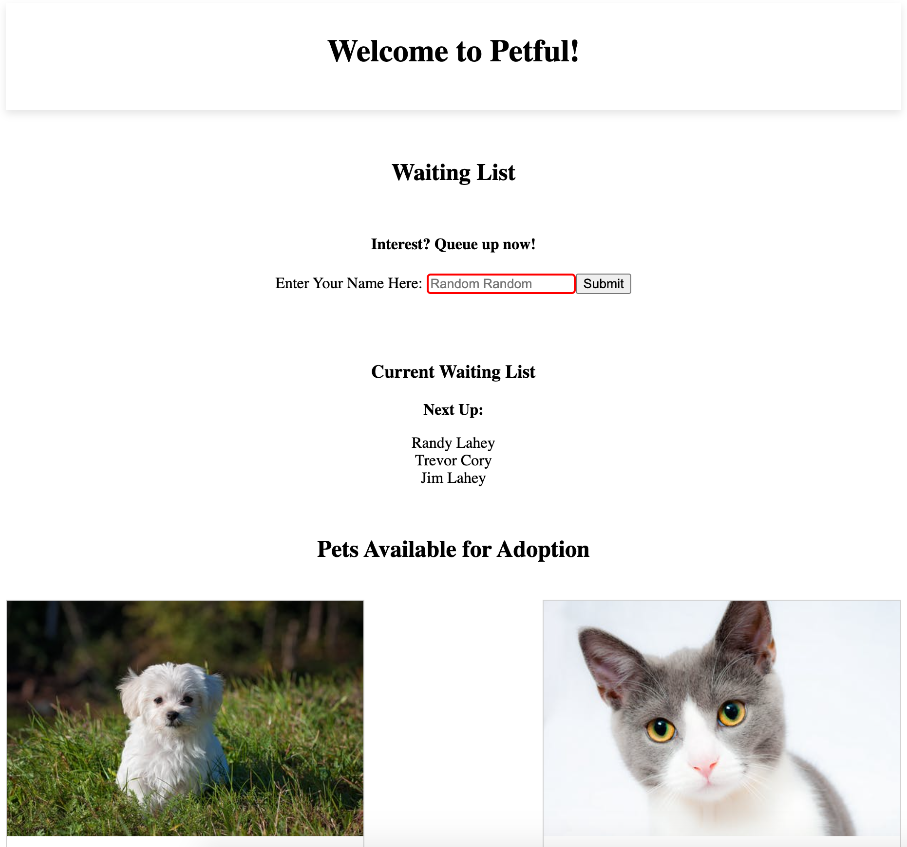
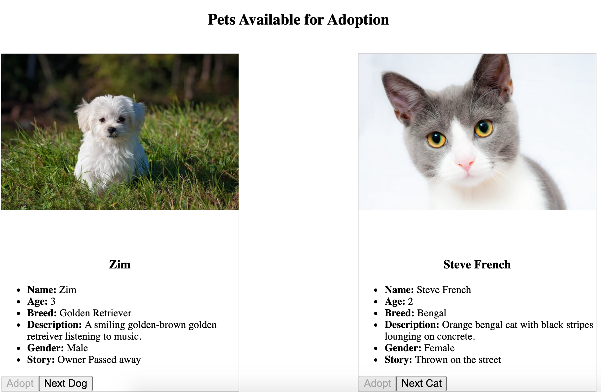
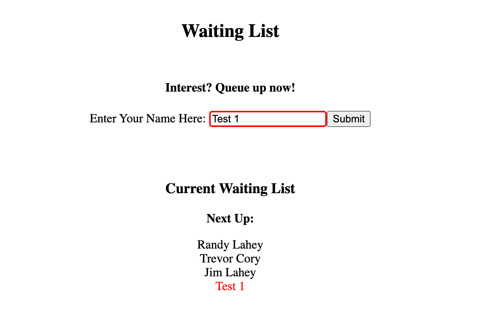
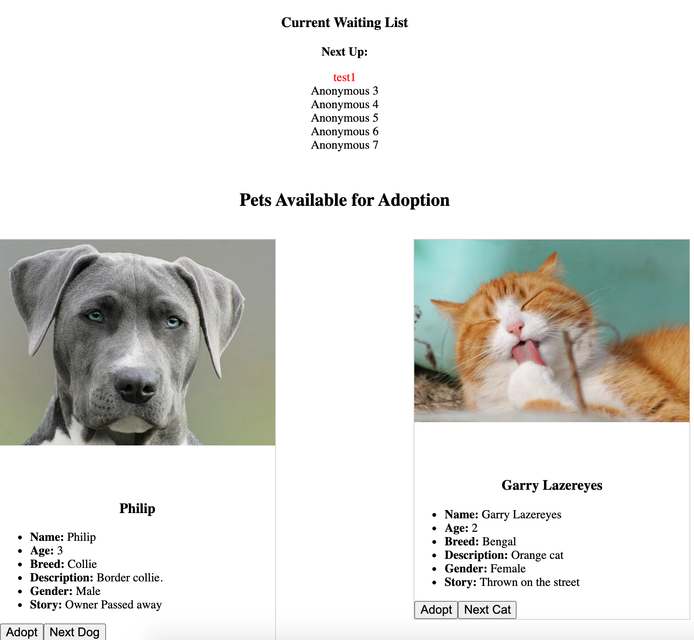
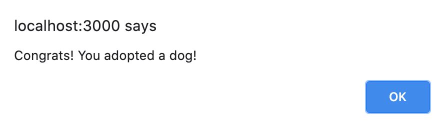

# Petful

* Live App: https://petful-client-app.vercel.app/
* Database URL: https://petful-29142.herokuapp.com/
* Client-Repo: https://github.com/uimm258/petful-client
* Server-Repo: https://github.com/uimm258/petful-server

### Stack Used

* Client: HTML, CSS, React.Js
* Server: Express and Node.Js

### User Stories
Connects to an API to get pets up for adoption in a FIFO structure.

As a visitor/user:
* I want to enter my name to join the waiting list 
* I want to see the dogs and cats
* I want to adopt a dog or a cat whenever it's my turn

### Screenshots of the app
* Dashboard
:-------------------------:

* Adopt Page
:-------------------------:

* Add Name
:-------------------------:

* Ready to Adopt
:-------------------------:

* Adopted!
:-------------------------:
